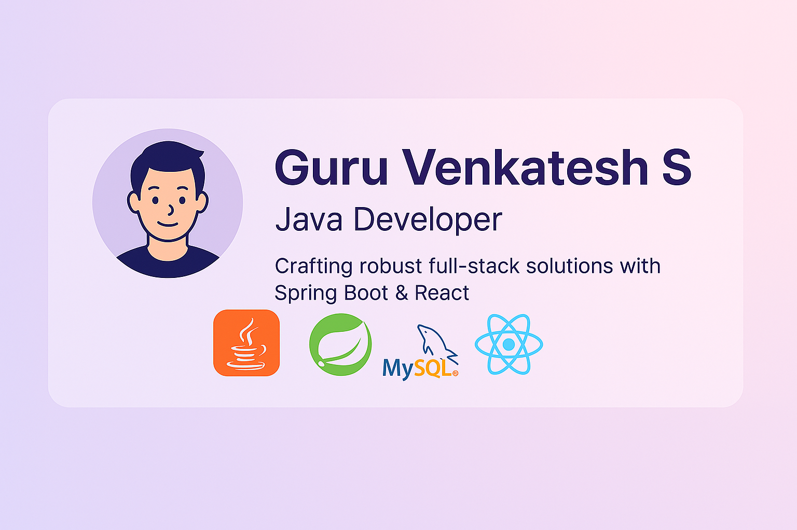

<!-- Banner Image (optional, host your own for best results) -->

  

<h1 align="center">Hi there, I'm Guru Venkatesh 👋</h1>

  <b>Java Full Stack Developer</b> | Electronics Engineering Graduate

  
  
  
  

---

## 🚀 About Me

> "Passionate Java developer eager to craft real-world solutions using clean architecture, scalable systems, and a touch of creativity."

- 🎓 Electronics Engineering Graduate  
- 💼 Java Full Stack Developer  
- 🧑‍💻 Certified in Java, SQL, and Python  
- 🔥 Always learning and building cool stuff

---

## 🛠️ Skills & Tools

  

**Languages:** Java, Python, C  
**Backend:** Spring Boot, Spring MVC, Spring Data JPA, REST APIs, Hibernate, Maven  
**Frontend:** React.js, Thymeleaf, HTML5, CSS3  
**Database:** MySQL, H2  
**Tools:** Git & GitHub, Docker, Postman, IntelliJ IDEA  
**Soft Skills:** Teamwork, Leadership, Time Management, Adaptability

---

## 🌟 Featured Projects

| Project | Description | Tech Stack | Link |
| ------- | ----------- | ---------- | ---- |
| **Resume Analyzer** | Analyzes resumes with Spring Boot & Python NLP to extract and evaluate skills, offering job-based suggestions. | Spring Boot, Python NLP | [GitHub](https://github.com/GURUVENKATESH03/Resume-Analyzer) |
| **Voice Text Reader** | Portable device for visually impaired, reads text from images aloud using Raspberry Pi, Python, OpenCV, EasyOCR. | Python, Raspberry Pi, OpenCV | [GitHub](https://github.com/GURUVENKATESH03/EasyOCR-and-Transliteration) |
| **Event Management System** | Full-stack app for event creation, registration, slot management, and role-based access. | Spring Boot, Thymeleaf, MySQL | [GitHub](https://github.com/GURUVENKATESH03/EventManagement) |
| **Meal Share** | Meal Share is a full-stack web application developed to address the growing issue of food waste by connecting food donors (restaurants, caterers, households) with individuals and NGOs in need. The platform streamlines surplus food sharing, ensures accountability, and promotes a sustainable ecosystem of food redistribution. | Spring Boot, Thymeleaf/React, MySQL | [GitHub](https://github.com/GURUVENKATESH03/foodsaver) |
---

## 🌐 Connect with Me

  <a href="https://guruvenkatesh.netlify.app/">🌐 Portfolio</a> • 
  <a href="https://www.linkedin.com/in/guru-venkatesh-b3ab16226">💼 LinkedIn</a> • 
  <a href="https://leetcode.com/u/GURU_VENKATESH/">🧠 LeetCode</a> • 

---

## 🎯 Fun Facts & Interests

- 📚 Always learning and upskilling
- 🧠 Active on LeetCode for DSA mastery
- 🛠 Loves working with Raspberry Pi & embedded systems
- 🧭 Favorite quote: *"Code is like humor. When you have to explain it, it’s bad." – Cory House*

---

  
  

<!-- Banner Image (optional, host your own for best results) -->

  

  

  
  
  
  

  

---

## 🚀 About Me

> "Passionate Java developer eager to craft real-world solutions using clean architecture, scalable systems, and a touch of creativity."

- 🎓 Electronics Engineering Graduate  
- 💼 Java Full Stack Developer  
- 🧑‍💻 Certified in Java, SQL, and Python  
- 🔥 Always learning and building cool stuff

---

## 🛠️ Skills & Tools

  

**Languages:** Java, Python, C  
**Backend:** Spring Boot, Spring MVC, Spring Data JPA, REST APIs, Hibernate, Maven  
**Frontend:** React.js, Thymeleaf, HTML5, CSS3  
**Database:** MySQL, H2  
**Tools:** Git & GitHub, Docker, Postman, IntelliJ IDEA  
**Soft Skills:** Teamwork, Leadership, Time Management, Adaptability

---

## 🌟 Featured Projects

| Project | Description | Tech Stack | Link |
| ------- | ----------- | ---------- | ---- |
| **Resume Analyzer** | Analyzes resumes with Spring Boot & Python NLP to extract and evaluate skills, offering job-based suggestions. | Spring Boot, Python NLP | [GitHub](https://github.com/GURUVENKATESH03/Resume_Analyzer) |
| **Voice Text Reader** | Portable device for visually impaired, reads text from images aloud using Raspberry Pi, Python, OpenCV, EasyOCR. | Python, Raspberry Pi, OpenCV | [GitHub](https://github.com/GURUVENKATESH03/Voice_text_reader) |
| **Event Management System** | Full-stack app for event creation, registration, slot management, and role-based access. | Spring Boot, Thymeleaf, MySQL | [GitHub](https://github.com/GURUVENKATESH03/Event_Management_System) |
| **Meal Share** | Meal Share is a full-stack web application developed to address the growing issue of food waste by connecting food donors (restaurants, caterers, households) with individuals and organizations in need. | React, Spring Boot, MySQL | [GitHub](https://github.com/GURUVENKATESH03/Meal_Share) |

---

## 📈 GitHub Stats

  

  
  
  

---

## 🌐 Connect with Me

  <a href="https://guruvenkatesh.netlify.app/">🌐 Portfolio</a> • 
  <a href="https://www.linkedin.com/in/guru-venkatesh-b3ab16226">💼 LinkedIn</a> • 
  <a href="https://leetcode.com/u/GURU_VENKATESH/">🧠 LeetCode</a>

---

## 🎯 Fun Facts & Interests

- 📚 Always learning and upskilling
- 🧠 Active on LeetCode for DSA mastery
- 🛠 Loves working with Raspberry Pi & embedded systems
- 🧭 Favorite quote: *"Code is like humor. When you have to explain it, it’s bad." – Cory House*

---

